<div align="center">

<!-- Animated Header with Gradient -->


<!-- Typing Animation -->
<a href="https://git.io/typing-svg"></a>

<br/>

<!-- Animated Social Badges -->
<p align="center">
  <a href="https://linkedin.com/in/benedict-garcia-tech">
    
  </a>
  <a href="mailto:job.benedictgarcia@outlook.com">
    
  </a>
  <a href="https://github.com/benben000000">
    
  </a>
</p>

<!-- Profile Views Counter with Animation -->
<p align="center">
  
  
</p>

<!-- Resume Button - Top of Page -->
<br/>

<p align="center">
  <a href="https://benben000000.github.io/benben000000/resume.html" target="_blank">
    
  </a>
</p>

<p align="center" style="font-size: 14px; color: #888;">
  💼 <strong>Available for HRIS/ERP Internship</strong> | 📍 Balanga City, Bataan, Philippines
</p>

</div>

---

## 🚀 About Me

<table>
<tr>
<td width="50%" valign="top">

**📍 Location:** Balanga City, Bataan, Philippines  
**🎓 Education:** Associates in Computer Technology  
**💼 Focus:** AI Engineering, Machine Learning & Data Analytics  
**🌱 Learning:** AI Validation (Groundedness, Hallucination Detection)  
**🎯 Goal:** Secure AI Engineer & Data Analyst Roles

<br/>

### 💻 What I Do

<br/>

```typescript
const benedict = {
    code: ["Python", "SQL", "TypeScript", "JavaScript", "R"],
    expertise: {
        ai_engineering: ["TensorFlow", "PyTorch", "Keras"],
        traditional_ml: ["Scikit-learn", "Predictive Modeling"],
        data_science: ["Pandas", "NumPy", "Matplotlib", "Seaborn"],
        computer_vision: ["OpenCV", "Image Processing"],
        nlp: ["NLTK", "Text Processing", "LLM Integration"]
    },
    metricsFocus: [
        "Classification: Accuracy, Precision, Recall, F1",
        "Ranking/Probabilistic: ROC-AUC",
        "Generative AI: Contextual Relevance, Groundedness"
    
    },
    currentProjects: [
        "Neuro Focus AI - ML-Powered Cognitive Engine",
        "Akashic Record - Intelligent Knowledge System",
        "Automated Data Pipeline & Analytics Dashboard",
        "Computer Vision Catalog Processor"
    ],
    challenge: "Building production-ready AI models and actionable data insights"
};
```

</td>
<td width="50%" valign="top">

<div align="center">

</div>

</td>
</tr>
</table>

<br/>

## 🛠️ Tech Stack & Skills

<div align="center">

### Machine Learning & Computer Vision
<p>
  
</p>

### Data Science & Analytics
<p>
  
</p>

### NLP & Libraries
<p>
  
  
  
  
</p>

### Development & DevOps
<p>
  
</p>


</div>

---

## 📊 Skill Proficiency

<div align="center">

<table width="100%">
<tr>
<td width="50%">

**AI & Deep Learning**
```
PyTorch/TF    ████████████████░░░░ 85%
Computer Vis  ████████████████░░░░ 80%
Scikit-learn  ███████████████░░░░░ 75%
NLP (NLTK)    ███████████████░░░░░ 75%
```

**Data Engineering & Viz**
```
Python        ██████████████████░░ 90%
Pandas/NumPy  ████████████████░░░░ 80%
PostgreSQL    ████████████████░░░░ 80%
EDA / Viz     ███████████████░░░░░ 75%
```

</td>
<td width="50%">

**AI Validation Metrics**
```
Model Class   Accuracy, Precision,
              Recall, F1 Score
Ranking       ROC-AUC
Modern GenAI  Contextual Relevance,
              Groundedness,
              Hallucination Detect
```

**Software Engineering**
```
REST APIs     ████████████████░░░░ 80%
Docker        █████████████░░░░░░░ 65%
Git/GitHub    ████████████████░░░░ 80%
Linux         ██████████████░░░░░░ 70%
```

</td>
</tr>
</table>

</div>

---

## 📈 Enhanced GitHub Metrics

<div align="center">

<!-- Profile Views & Stats -->
<p>
  
  
  
</p>

</div>

---

## 📥 Resume & Contact

<div align="center">

**🎯 Seeking AI Engineer & Data Analyst Opportunities**

<br/>

<a href="https://benben000000.github.io/benben000000/resume.html" target="_blank">
  
</a>

<br/><br/>

<a href="mailto:job.benedictgarcia@outlook.com">
  
</a>
<a href="https://linkedin.com/in/benedict-garcia-tech">
  
</a>

**📍 Available for:** Immediate start | **💼 Location:** Balanga City, Bataan, Philippines

</div>

---

## 📊 GitHub Analytics

<div align="center">

<a href="https://github.com/benben000000">
  
  
</a>

<br/><br/>

<a href="https://github.com/benben000000">
  
  
</a>

</div>

---

## � Interactive Game - Contribution Snake!

<div align="center">

**🐍 Watch the snake eat my contributions! 🐍**

<picture>
  <source media="(prefers-color-scheme: dark)" srcset="https://raw.githubusercontent.com/benben000000/benben000000/output/github-contribution-grid-snake-dark.svg">
  <source media="(prefers-color-scheme: light)" srcset="https://raw.githubusercontent.com/benben000000/benben000000/output/github-contribution-grid-snake.svg">
  
</picture>

_The snake eats all my GitHub contributions! Refresh to watch it again!_ 🎯

</div>

---

## �🏆 GitHub Trophies

<div align="center">


</div>

---

## 💼 Featured Projects

<div align="center">

### ⭐ Featured AI & Data Projects (Pinned)

<table>
<tr>
<td width="33%" align="center">


**🧠 ML-Powered Cognitive Engine**
- Neural network architectures
- Optimization & Loss functions
- Contextual relevance metrics
- Real-time data processing
- TensorFlow & PyTorch


</td>
<td width="33%" align="center">


**📚 Intelligent NLP System**
- Natural Language Processing
- Contextual Groundedness
- Text mining & Validation
- Data manipulation (Pandas)
- F1, Recall & Precision


</td>
<td width="33%" align="center">


**📈 Predictive HR Analytics**
- PostgreSQL data warehousing
- Visualizations (Seaborn)
- Predictive classification
- Model Accuracy metrics
- ROC-AUC evaluation


</td>
</tr>
</table>

---

### 📦 Complete Project Portfolio

<details>
<summary><b>🔽 All Projects (10 repositories)</b></summary>

<br>

#### 🤖 AI & Machine Learning

**1. 🧠 [Neuro Focus AI](https://github.com/benben000000/neuro-focus-ai)** ⭐
> AI-powered studying application featuring intelligent note summarization, focus tracking, and productivity enhancement using deep learning frameworks. Evaluates models using F1, Accuracy, and Recall metrics.
> 
> **Tech:** `Python` `TensorFlow` `PyTorch` `Scikit-learn`  
> **Last Updated:** December 2025

**2. 📚 [Akashic Record](https://github.com/benben000000/akashic-record)** ⭐
> Intelligent knowledge management system. Utilizes NLP tools (NLTK) to analyze documents, extract topics, and cross-reference information ensuring high contextual relevance and groundedness.
> 
> **Tech:** `Python` `NLTK` `NLP` `Knowledge Engine`  
> **Last Updated:** 1 week ago

---

#### 📊 Data Analytics & Engineering

**3. 🏭 [Computer Vision Part Processor](#)**
> Custom CV pipeline utilizing OpenCV to read, process, and classify images of automotive parts, achieving high precision in OCR transcription to dataframes.
> 
> **Tech:** `Python` `OpenCV` `Pandas` `NumPy`  
> **Last Updated:** 2 weeks ago

**4. 📈 [HR Analytics Pipeline (Mini HRIS)](https://github.com/benben000000/mini-hris)**
> Originally an HRIS system, extended with advanced data pipelines, generating analytical insights visualized via Matplotlib and Seaborn to predict employee attrition.
> 
> **Tech:** `Python` `Pandas` `PostgreSQL` `Seaborn`  
> **Last Updated:** Recently

---

#### 🌐 Software Engineering & Backend

**5. 🔗 [Lead Integration API](https://github.com/benben000000/lead-integration)**
> Specialized backend microservice that streams real-time data from webhooks, sanitizing inputs before feeding into central data warehouses.
> 
> **Tech:** `Python` `Flask` `Docker` `ETL`  
> **Last Updated:** Recently

**6. 🏗️ [Operations Command Center](https://github.com/benben000000/monorepo-turborepo)**
> Data visualization dashboard for enterprise systems giving real-time telemetry of operations.
> 
> **Tech:** `TypeScript` `React` `Data Viz`  
> **Last Updated:** 4 days ago

---

#### 📊 Project Statistics

<table align="center">
<tr>
<td align="center">

**Category**

</td>
<td align="center">

**Projects**

</td>
<td align="center">

**Primary Tech**

</td>
</tr>
<tr>
<td>🤖 AI & Machine Learning</td>
<td align="center">3</td>
<td>PyTorch, TensorFlow, Scikit-learn</td>
</tr>
<tr>
<td>📊 Data Analytics & Pipeline</td>
<td align="center">2</td>
<td>Pandas, NumPy, Matplotlib, OpenCV</td>
</tr>
<tr>
<td>🌐 API & Backends</td>
<td align="center">3</td>
<td>Python, PostgreSQL, Flask</td>
</tr>
<tr>
<td>💼 Other Domains</td>
<td align="center">2</td>
<td>TypeScript, React</td>
</tr>
<tr>
<td><b>Total</b></td>
<td align="center"><b>10</b></td>
<td><b>Multi-Tech Stack</b></td>
</tr>
</table>

**📈 Portfolio Metrics:**
- **Total Lines of Code:** 10,000+
- **Production-Ready Systems:** 5
- **Languages:** Python, TypeScript, Hack, PHP, SQL
- **Active Development:** Ongoing

</details>

</div>

---

## 🎓 Learning Journey & Roadmap

```mermaid
%%{init: {'theme':'dark', 'themeVariables': { 'darkMode': true }}}%%
graph LR
    A[🐍 Python/SQL Data Foundations] -->|Mastered| B[📊 Pandas & Data Analytics]
    B -->|Completed| C[🧠 Scikit-Learn & ML]
    C -->|In Progress| D[🔥 PyTorch & TensorFlow]
    D -->|Next| E[👁️ OpenCV & NLP Systems]
    E -->|Goal| F[📈 Model Validation & Metrics]
    F -->|Target| G[💼 AI Engineer/Data Analyst Roles 🎯]
    
    style A fill:#3776AB,stroke:#fff,stroke-width:2px,color:#fff
    style B fill:#150458,stroke:#fff,stroke-width:2px,color:#fff
    style C fill:#F7931E,stroke:#fff,stroke-width:2px,color:#000
    style D fill:#EE4C2C,stroke:#fff,stroke-width:2px,color:#fff
    style E fill:#000000,stroke:#fff,stroke-width:2px,color:#fff
    style F fill:#2E9EF7,stroke:#fff,stroke-width:2px,color:#fff
    style G fill:#00FF00,stroke:#fff,stroke-width:3px,color:#000
```



<details>
<summary><b>📅 12-Week Structured Learning Path</b></summary>

<br/>

| Week | Module | Status | Key Achievements |
|:----:|:-------|:------:|:----------------|
| 1-3 | 🐍 Python Data Stack | ✅ | Pandas, NumPy, Matplotlib, Seaborn |
| 4-5 | 🗄️ Database & SQL | ✅ | Queries, Data Wrangling, Postgres |
| 6-7 | 🧠 Traditional ML | ✅ | Scikit-learn, Regression, Classification |
| 8-9 | 🔥 Deep Learning | 🔄 | TensorFlow, PyTorch, Keras |
| 10 | 👁️ Computer Vision & NLP | 📅 | OpenCV, NLTK, Prompt Engineering |
| 11 | 📈 Model Validation | 📅 | ROC-AUC, F1, Groundedness Detection |
| 12 | 🚀 Portfolio & Deployment | 📅 | Dockerizing AI Models |

**Legend:** ✅ Completed | 🔄 In Progress | 📅 Planned

</details>

---

## 🏆 Achievements & Metrics

<div align="center">

<table>
<tr>
<td align="center" width="25%">


**Lines of Code**

**10,000+**

</td>
<td align="center" width="25%">


**Projects**

**10 Repos**

</td>
<td align="center" width="25%">


**Test Coverage**

**85%+**

</td>
<td align="center" width="25%">


**Technologies**

**15+**

</td>
</tr>
</table>

</div>

---

## � Connect With Me

<div align="center">


**🚀 Open to HRIS/ERP Internship Opportunities!**

<br/>

[](mailto:job.benedictgarcia@outlook.com)
[](https://linkedin.com/in/benedict-garcia-tech)
[](https://github.com/benben000000)

<br/>

📍 **Location:** Balanga City, Bataan, Philippines  
💼 **Role Focus:** AI Engineer, Data Analyst, Machine Learning  
📚 **Currently Learning:** Advanced Deep Learning, Hallucination Detection & Context Validation  
⚡ **Fun Fact:** I've built 5 production-ready systems while learning!

---


### 💡 _"Building production-ready systems, one commit at a time."_

<sub>Last Updated: January 2026 • Built with ❤️ and lots of ☕</sub>

</div>
