<div align="center">

# 👋 Hi, I'm Benedict M. Garcia

[](https://git.io/typing-svg)

<p align="center">
  <a href="https://linkedin.com/in/benedict-garcia-tech"></a>
  <a href="mailto:job.benedictgarcia@outlook.com"></a>
  <a href="https://github.com/benben000000"></a>
</p>

### 🎯 Aspiring HRIS/ERP Developer | Building Real-World Solutions

</div>

---

## 🚀 About Me

```python
class BenedictGarcia:
    def __init__(self):
        self.location = "Balanga City, Bataan, Philippines"
        self.education = "Associates in Computer Technology"
        self.current_focus = "HRIS/ERP Systems Development"
        self.learning = ["Python", "Odoo", "PostgreSQL", "REST APIs", "Docker"]
        self.goal = "Secure HRIS/ERP Internship at AWB"
    
    def get_tech_stack(self):
        return {
            "backend": ["Python", "Flask", "Odoo"],
            "database": ["PostgreSQL", "SQLAlchemy"],
            "apis": ["REST", "XML-RPC", "Webhooks"],
            "devops": ["Docker", "Git", "Linux"],
            "testing": ["pytest", "Postman"],
        }
    
    def current_projects(self):
        return [
            "Mini HRIS System - Employee Management API",
            "Custom Odoo HR Module - Extended HR Features",
            "Lead Integration API - Webhook to Odoo CRM"
        ]
```

---

## 🛠️ Tech Stack

### Languages & Frameworks


### Databases & ORMs


### ERP & Integration


### DevOps & Tools


---

## 📊 GitHub Stats

<div align="center">
  


</div>

---

## 💼 Featured Projects

<div align="center">

### ⭐ Latest HRIS/ERP Projects (Pinned)

<table>
<tr>
<td width="33%">

### 🏢 [Mini HRIS System](https://github.com/benben000000/mini-hris)
**Full-stack employee management**
- Flask REST API (15+ endpoints)
- PostgreSQL (6 tables)
- Automated payroll + overtime
- 85% test coverage
- Docker ready


</td>
<td width="33%">

### 🎯 [Custom Odoo HR Module](https://github.com/benben000000/custom-hr-module)
**Extended Odoo HR features**
- Custom employee models
- Certification tracking
- Performance reviews
- Skills management
- Custom views (form/tree/kanban)


</td>
<td width="33%">

### 🔗 [Lead Integration API](https://github.com/benben000000/lead-integration)
**Webhook to Odoo CRM**
- Form to CRM automation
- Input validation
- Rate limiting + auth
- XML-RPC integration
- Error handling


</td>
</tr>
</table>

---

### 📦 Complete Project Portfolio

<details open>
<summary><b>🔽 All Projects (13 repositories)</b></summary>

<br>

#### 🤖 AI & Productivity Applications

**1. 🧠 [Neuro Focus AI](https://github.com/benben000000/neuro-focus-ai)** | **[Alt Version](https://github.com/benben000000/neurofocusai)**
> AI-powered focus and productivity enhancement tool leveraging machine learning for cognitive optimization and task management.
> 
> **Tech:** `AI/ML` `Python` `Neural Networks`

**2. 💎 [Benlium](https://github.com/benben000000/benlium)**
> Advanced personal knowledge management system with AI integration for research, note-taking, and idea connections.
> 
> **Tech:** `React` `TypeScript` `AI Integration`

**3. 📚 [Akashic Record](https://github.com/benben000000/akashic-record)**
> Digital knowledge repository and documentation system for storing and organizing technical learnings and resources.
> 
> **Tech:** `Markdown` `Documentation` `Knowledge Base`

---

#### 🏢 HRIS/ERP & Business Systems

**4. 🏢 [Mini HRIS System](https://github.com/benben000000/mini-hris)** ⭐
> Complete employee management system with REST API, automated payroll, attendance tracking, and Docker deployment. Built with Flask, PostgreSQL, and pytest for 85% test coverage.
> 
> **Tech:** `Python` `Flask` `PostgreSQL` `SQLAlchemy` `Docker` `pytest`

**5. 🎯 [Custom Odoo HR Module](https://github.com/benben000000/custom-hr-module)** ⭐
> Extended Odoo HR functionality with certification tracking, performance management, skills database, and custom views. Production-ready module with full security implementation.
> 
> **Tech:** `Odoo 17` `Python` `PostgreSQL` `XML` `ORM`

**6. 🔗 [Lead Integration API](https://github.com/benben000000/lead-integration)** ⭐
> Webhook API for seamless website-to-Odoo CRM integration. Features input validation, rate limiting, API key authentication, and comprehensive error handling.
> 
> **Tech:** `Python` `Flask` `Odoo XML-RPC` `Redis` `Docker`

**7. 🎛️ [Operations Command Center SaaS](https://github.com/benben000000/Operations-Command-Center-SaaS)**
> Enterprise operations management platform for real-time monitoring, analytics, and command center functionalities.
> 
> **Tech:** `SaaS` `Real-time Analytics` `Dashboard`

---

#### 🚀 Full-Stack & Architecture

**8. 🏗️ [Monorepo Turborepo](https://github.com/benben000000/monorepo-turborepo)**
> Modern monorepo architecture using Turborepo for efficient multi-package management and build optimization.
> 
> **Tech:** `Turborepo` `Monorepo` `TypeScript` `Build Tools`

**9. 📱 [WTI](https://github.com/benben000000/WTI)**
> Web Technologies Implementation project showcasing modern web development practices and frameworks.
> 
> **Tech:** `Web Technologies` `Modern Stack`

---

#### 🖥️ Desktop Applications

**10. 🎨 [Windows Forms App](https://github.com/benben000000/windowsformapp)** | **[v1](https://github.com/benben000000/WinFormsApp1)**
> Windows desktop applications built with .NET Windows Forms for GUI-based user interactions.
> 
> **Tech:** `C#` `.NET` `Windows Forms` `Desktop Development`

---

#### � Creative & Personal Projects

**11. 👨‍💻 [Benedict Garcia Portfolio](https://github.com/benben000000/benedictgarcia)**
> Personal portfolio website showcasing projects, skills, and professional journey.
> 
> **Tech:** `Portfolio` `Web Development`

---

#### 📊 Project Statistics

| Category | Projects | Primary Tech |
|----------|----------|--------------|
| 🤖 AI & Productivity | 3 | Python, AI/ML, TypeScript |
| 🏢 HRIS/ERP Systems | 4 | Python, Odoo, PostgreSQL, Flask |
| 🚀 Full-Stack | 2 | Turborepo, Web Tech |
| 🖥️ Desktop Apps | 2 | C#, .NET |
| 🎨 Creative | 1 | Web, Portfolio |
| **Total** | **13** | **Multi-Tech Stack** |

**Total Lines of Code:** 10,000+  
**Production-Ready Systems:** 6  
**Active Development:** Ongoing

</details>

</div>

---

## 🎓 Learning Journey

```mermaid
graph LR
    A[Python Fundamentals] --> B[PostgreSQL & SQL]
    B --> C[Flask APIs]
    C --> D[Odoo Development]
    D --> E[Docker & DevOps]
    E --> F[Production Deployment]
    F --> G[AWB Internship Ready! 🎯]
    
    style A fill:#3776AB
    style B fill:#316192
    style C fill:#000000
    style D fill:#8F419A
    style E fill:#2496ED
    style F fill:#2E9EF7
    style G fill:#00FF00
```



**12-Week Structured Learning Path:**
- ✅ Week 1-2: Python fundamentals & OOP
- ✅ Week 3-4: PostgreSQL & database design
- ✅ Week 5-6: JavaScript & Docker basics
- 🔄 Week 7-8: Odoo framework (in progress)
- 📅 Week 9-10: API development & integration
- 📅 Week 11: Testing & documentation
- 📅 Week 12: Portfolio polish & deployment

---

## 🏆 Achievements

<div align="center">

| Metric | Value |
|--------|-------|
| **Lines of Code** | 4,500+ |
| **Projects Completed** | 3 Production-Ready |
| **Test Coverage** | 85%+ |
| **Technologies Mastered** | 15+ |
| **Commits This Month** |  |

</div>

---

## 📫 Let's Connect!

<div align="center">

**Open to HRIS/ERP internship opportunities!**

[](mailto:job.benedictgarcia@outlook.com)
[](https://linkedin.com/in/benedict-garcia-tech)
[](https://github.com/benben000000)

📍 **Location:** Balanga City, Bataan, Philippines  
💼 **Available for:** HRIS/ERP Internship  
📚 **Currently Learning:** Advanced Odoo Development & API Integration

---

### 💡 "Building production-ready systems, one commit at a time."


</div>

<!--
**benben000000/benben000000** is a ✨ _special_ ✨ repository because its `README.md` (this file) appears on your GitHub profile.
-->
